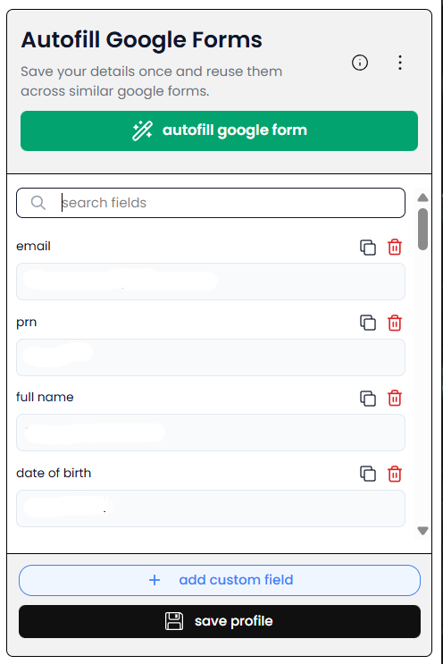
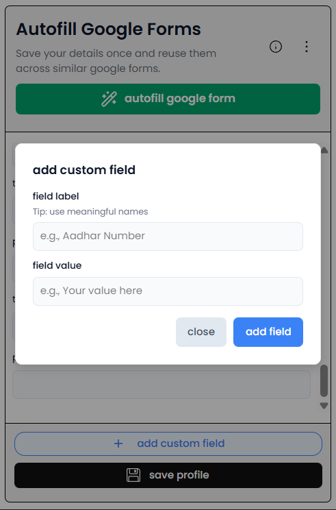
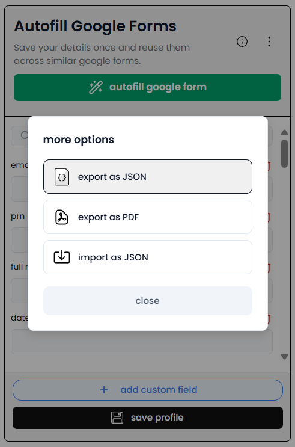
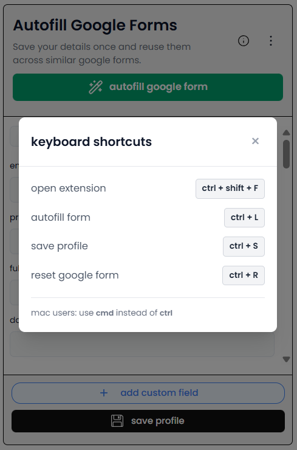

# Google Form Autofill

[](https://opensource.org/licenses/MIT)
[](https://github.com/tejaspokale22/google-form-autofill/stargazers)
[](https://github.com/tejaspokale22/google-form-autofill/network/members)
[](#contributing)

A browser extension designed to streamline the process of filling out repetitive Google Forms. Save your information once and autofill it across similar forms with a single click.

## Table of Contents

- [Installation](#installation)
  - [Chrome Web Store](#chrome-web-store)
  - [Manual Installation](#manual-installation)
- [Features](#features)
  - [Profile Management](#profile-management)
  - [Smart Autofill](#smart-autofill)
  - [Data Portability](#data-portability)
  - [Search & Filter](#search--filter)
  - [Keyboard Shortcuts](#keyboard-shortcuts)
  - [Field Operations](#field-operations)
- [Screenshots](#screenshots)
- [Usage](#usage)
  - [Basic Workflow](#basic-workflow)
  - [Standard Fields Included](#standard-fields-included)
  - [Custom Fields](#custom-fields)
  - [Import/Export](#importexport)
- [Technology Stack](#technology-stack)
- [Development](#development)
  - [Prerequisites](#prerequisites)
  - [Available Scripts](#available-scripts)
  - [Project Structure](#project-structure)
- [Privacy & Security](#privacy--security)
- [Browser Compatibility](#browser-compatibility)
- [Troubleshooting](#troubleshooting)
- [Contributing](#contributing)
- [License](#license)
- [Support](#support)

## Installation

### Microsoft Add-ons

Install directly from the Microsoft Add-ons:

**[Add to Microsoft Edge - Google Form Autofill](https://microsoftedge.microsoft.com/addons/detail/cbkbaoajmojgagkplfihcajkagokcnif)**

### Manual Installation

1. Clone this repository

   ```bash
   git clone https://github.com/yourusername/google-form-autofill.git
   cd google-form-autofill
   ```

2. Install dependencies

   ```bash
   npm install
   ```

3. Build the extension

   ```bash
   npm run build
   ```

4. Load in Chrome
   - Navigate to `chrome://extensions/`
   - Enable "Developer mode"
   - Click "Load unpacked"
   - Select the `dist` folder

## Features

### Profile Management

- Save form data in a persistent profile stored in Chrome sync storage
- Pre-configured standard fields for common form inputs
- Add unlimited custom fields with label matching
- Hide/remove unwanted fields from your profile

### Smart Autofill

- One-click autofill for Google Forms
- Intelligent field matching based on label keywords
- Supports text inputs, textareas, dropdowns, radio buttons, and checkboxes
- Real-time status notifications

### Data Portability

- Export profile as JSON for backup or sharing
- Import profile from JSON files with duplicate detection
- Generate PDF reports of saved profiles
- Automatic field validation during import

### Search & Filter

- Real-time search across all fields
- Quickly locate specific fields in large profiles
- Visual feedback for empty results

### Keyboard Shortcuts

- `Ctrl + S` - Save profile
- `Ctrl + L` - Autofill form
- `Ctrl + R` - Reset form fields
- `Ctrl + Shift + F` - Open extension popup

### Field Operations

- Copy field values to clipboard with one click
- Remove fields from profile view
- Duplicate skipping during JSON import
- Visual confirmation for copy operations

## Screenshots

### Main Interface



Main extension popup with saved form fields and quick access controls.

### Adding Custom Fields



Add custom fields by specifying label keywords that match form field labels.

### More Options



Access JSON import/export and PDF generation features.

### Keyboard Shortcuts



View all available keyboard shortcuts for quick access.

## Usage

### Basic Workflow

1. **Open Extension**

   - Click the extension icon or press `Ctrl + Shift + F`

2. **Enter Your Information**

   - Fill in standard fields (email, name, mobile, etc.)
   - Add custom fields using the "+" button for form-specific inputs

3. **Save Profile**

   - Click "Save Profile" or press `Ctrl + S`

4. **Autofill Forms**
   - Navigate to any Google Form
   - Open the extension and click "Autofill Google Form" or press `Ctrl + L`

### Standard Fields Included

The extension comes pre-configured with these standard fields:

- Email, PRN, Full Name, Date of Birth, Mobile Number, Gender
- College Name, Degree, Branch, Year of Graduation
- 10th %, 12th %, Diploma %, BE/BTech %
- Cocubes Score
- CodeChef Rating & Profile Link
- HackerRank Rating & Profile Link
- LeetCode Score & Profile Link
- HackerEarth Rating & Profile Link
- GitHub & LinkedIn Profile Links
- Technical Courses/Certifications, Platform, Duration
- CGPA

### Custom Fields

Create custom fields for form-specific questions:

1. Click the "+" button
2. Enter a label keyword (e.g., "project title")
3. Enter the value to autofill
4. The keyword will match form field labels containing that text

### Import/Export

**Export Profile**

- Click More Options → Export JSON
- Downloads a JSON file with your profile data

**Import Profile**

- Click More Options → Import JSON
- Select a previously exported JSON file
- Duplicate fields are automatically detected and skipped

**Export PDF**

- Click More Options → Export PDF
- Generates a printable PDF report of your profile

## Technology Stack

- React 19.2.0
- Vite 7.2.4
- Tailwind CSS 4.1.17
- jsPDF 3.0.4
- Chrome Extension Manifest V3

## Development

### Prerequisites

- Node.js (v16 or higher)
- npm
- Google Chrome

### Available Scripts

```bash
npm run dev      # Development build with hot reload
npm run build    # Production build
npm run lint     # Run ESLint
npm run preview  # Preview production build
```

### Project Structure

```
google-form-autofill/
├── public/
│   ├── content.js          # Content script for form interaction
│   ├── manifest.json       # Extension manifest
│   └── ss/                 # Screenshots
├── src/
│   ├── components/         # React components
│   │   └── more/          # Import/Export components
│   ├── hooks/              # useKeyboardShortcuts hook
│   ├── utils/              # constants.js with field definitions
│   ├── Popup.jsx           # Main popup interface
│   └── main.jsx            # Entry point
├── package.json
└── vite.config.js
```

## Privacy & Security

- All data stored locally in Chrome sync storage
- No external servers or data transmission
- No tracking or analytics
- Open source code
- Minimal permissions requested

### Required Permissions

- `storage` - Store profile data in Chrome sync storage
- `activeTab` - Access current tab to autofill forms
- `scripting` - Inject content script for form manipulation
- `host_permissions` - Limited to `https://docs.google.com/forms/*`

## Browser Compatibility

- Google Chrome (Manifest V3 compatible)
- Microsoft Edge (Chromium)
- Brave Browser
- Other Chromium-based browsers

## Troubleshooting

**Autofill not working**

- Verify you're on a Google Form (`https://docs.google.com/forms/*`)
- Refresh the page and try again
- Check that form fields have recognizable labels

**Fields not matching**

- Custom fields require partial label matches
- Check for typos in label keywords
- Some forms use unique field labels - add them as custom fields

**Import failing**

- Ensure JSON file is valid format
- File size must be under 5MB
- Check for proper field structure in JSON

## Contributing

We welcome contributions from the community! This is an open source project and we appreciate your help in making it better.

### How to Contribute

1. **Fork the Repository**

   - Click the "Fork" button at the top right of this repository

2. **Clone Your Fork**

   ```bash
   git clone https://github.com/your-username/google-form-autofill.git
   cd google-form-autofill
   ```

3. **Create a Branch**

   ```bash
   git checkout -b feature/your-feature-name
   ```

4. **Make Your Changes**

   - Write clean, readable code
   - Follow the existing code style
   - Test your changes thoroughly

5. **Commit Your Changes**

   ```bash
   git add .
   git commit -m "Add: your feature description"
   ```

6. **Push to Your Fork**

   ```bash
   git push origin feature/your-feature-name
   ```

7. **Open a Pull Request**
   - Go to the original repository
   - Click "New Pull Request"
   - Select your fork and branch
   - Describe your changes in detail

### Contribution Guidelines

- **Bug Reports**: Open an issue with a clear description and steps to reproduce
- **Feature Requests**: Open an issue describing the feature and its use case
- **Code Contributions**: Ensure code is well-tested and documented
- **Major Changes**: Discuss in an issue before starting work

### Development Setup

1. Install dependencies: `npm install`
2. Run development build: `npm run dev`
3. Load the extension in Chrome from the `dist` folder
4. Make changes and test
5. Run linter: `npm run lint`

### Code of Conduct

- Be respectful and inclusive
- Provide constructive feedback
- Focus on what is best for the community

## License

This project is licensed under the MIT License - see the [LICENSE](LICENSE) file for details.

### MIT License Summary

You are free to:

- Use this software commercially
- Modify the source code
- Distribute the software
- Use it privately

Under the condition that:

- The original copyright and license notice must be included

## Support

### Getting Help

- **Bug Reports**: [Open an issue](https://github.com/yourusername/google-form-autofill/issues) with detailed information
- **Feature Requests**: [Submit an issue](https://github.com/yourusername/google-form-autofill/issues) describing your idea
- **Questions**: Check [existing issues](https://github.com/yourusername/google-form-autofill/issues) or open a new one
- **Documentation**: Review this README and the code comments

### Community

This is an open source project maintained by the community. All contributions are appreciated!

- Star the repository if you find it useful
- Share with others who might benefit
- Contribute code, documentation, or ideas
